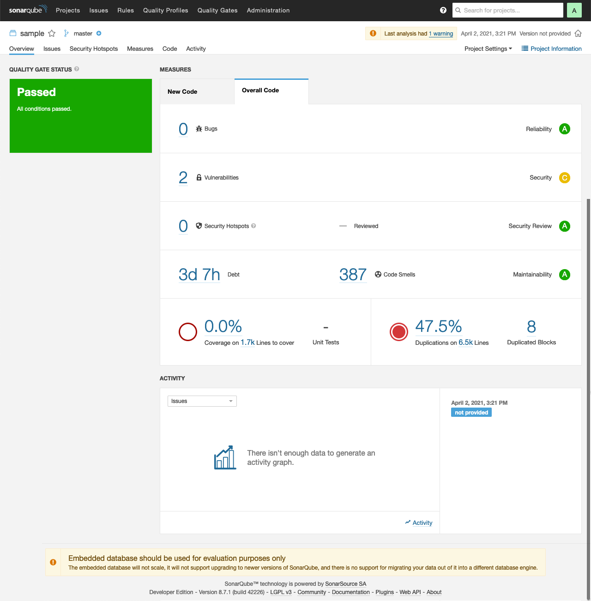

# db\* CODECOP for SonarQube

## Introduction

[db\* CODECOP for SonarQube](https://github.com/Trivadis/plsql-cop-sonar) is a plugin for [SonarQube](http://www.sonarqube.org/). The plugin analyses SQL and PL/SQL code and calculates various metrics and checks the code for compliance of this coding guideline.

A static code analysis is typically initiated as part of an continuous integration setup, e.g. at the end of a Jenkins or Hudson build job. SonarQube stores the result of the analysis in a relational database. Supported are PostgreSQL, Microsoft SQL Server and Oracle Database. For evaluation purposes, the embedded H2 database can also be used.

Since every analysis is stored as a snapshot in the SonarQube repository the improvement or the decrease of the code quality may be monitored very well. Use SonarQube and the db\* CODECOP plugin if you care about your PL/SQL code quality.

## Examples

### Run Code Analysis via SonarScanner

You start an analysis from the command line as follows (see [docs](https://docs.sonarqube.org/latest/analysis/scan/sonarscanner/) for more information):

```
sonar-scanner -Dsonar.projectKey="sample"
```

Here's an excerpt of the output:

```
INFO: Scanner configuration file: /usr/local/opt/sonar-scanner/conf/sonar-scanner.properties
INFO: Project root configuration file: NONE
INFO: SonarQube Scanner 4.1.0.1829
...
INFO: Project configuration:
INFO: 115 files indexed
INFO: Quality profile for plsql: db* CODECOP
INFO: ------------- Run sensors on module sample
INFO: JavaScript/TypeScript frontend is enabled
INFO: Define db* CODECOP PlugIn (Secondary)
INFO: Load metrics repository
INFO: Load metrics repository (done) | time=36ms
INFO: PlSQL COP Sensor initializing
INFO: Instantiate class: com.trivadis.sonar.plugin.TrivadisGuidelines3ValidatorConfig
INFO: Sensor CSS Rules [cssfamily]
INFO: No CSS, PHP, HTML or VueJS files are found in the project. CSS analysis is skipped.
INFO: Sensor CSS Rules [cssfamily] (done) | time=1ms
INFO: Sensor PL/SQL Sensor [plsql]
INFO: 115 source files to be analyzed
INFO: Load project repositories
INFO: Load project repositories (done) | time=10ms
...
INFO: Analysis report generated in 149ms, dir size=603 KB
INFO: Analysis report compressed in 1101ms, zip size=264 KB
INFO: Analysis report uploaded in 1858ms
INFO: ANALYSIS SUCCESSFUL, you can browse http://localhost:9000/dashboard?id=sample
INFO: Note that you will be able to access the updated dashboard once the server has processed the submitted analysis report
INFO: More about the report processing at http://localhost:9000/api/ce/task?id=AXiSv3IJVMRTx5sCSVMo
INFO: Analysis total time: 27.088 s
INFO: ------------------------------------------------------------------------
INFO: EXECUTION SUCCESS
INFO: ------------------------------------------------------------------------
INFO: Total time: 28.961s
INFO: Final Memory: 40M/144M
INFO: ------------------------------------------------------------------------
```

At the end of the run an URL to the scanner result is provided.

### Run Code Analyis with CI Environments

You can call the SonarScanner also from Gradle, .NET projects, Maven, Ant, Jenkins, etc. Whichever method you use, in the end the analysis report will be uploaded to SonarQube.

See [SonarScanner](https://docs.sonarqube.org/latest/analysis/scan/sonarscanner/) for more information.

### View Code Analysis Result in SonarQube

Here are the results of the previous analysis.



Under `Issues` the following `Blocker` are shown:


By clicking on the reddish box you can drill down to the source code.


When clicking on `Why is this an issue?` the complete rule is shown in similar way as in these guidelines.


See [SonarQube documentation](https://docs.sonarqube.org/latest/) for more information.
