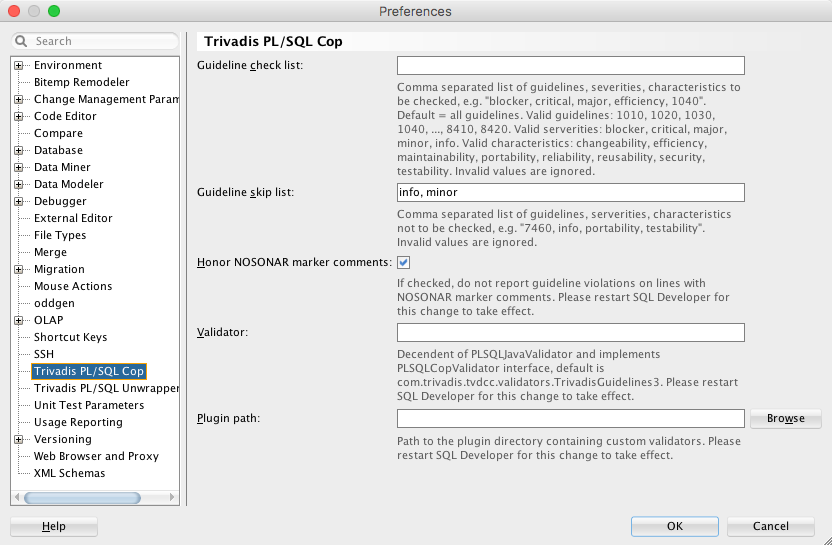
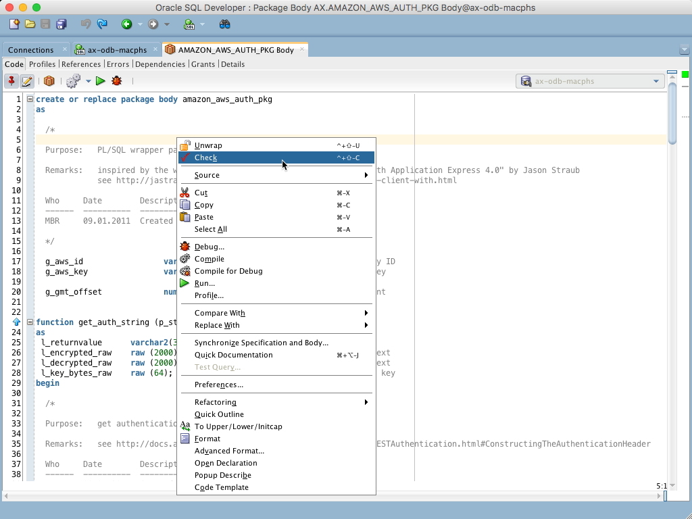
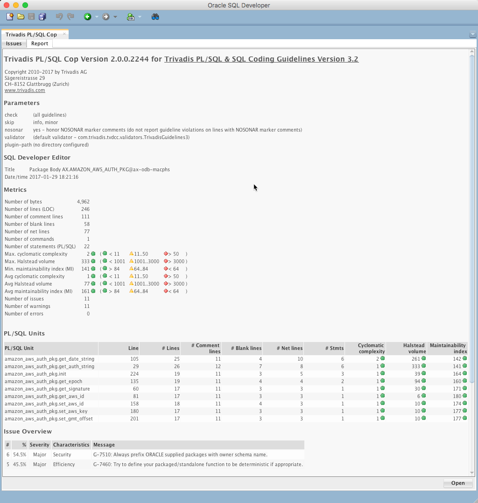

# Tool Support

## Development

Trivadis offers a cost-free extension to Oracle SQL Developer to test compliance with this coding guideline. The extension may be parameterized to your preferred set of rules and allows checking this set against a program unit.

### Setting the preferences

There is an include list as well as an exclude list to define which rules to be checked or ignored.

### Activate PLSQL Cop using context menu

The result of the ckecking process is a list of violations with direct links to the place in the code as well as software metrics like:

* Cyclomatic complexity
* Halstead volume
* Maintainability Index
* Number of lines of code
* Number of comment lines
* Issue Overview

This statistics are gathered for each program unit in the reviewed code.

### Software metrics

