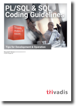

# Appendix 

## A - PL/SQL & SQL Coding Guidelines as PDF

These guidelines are primarily produced in [HTML](https://trivadis.github.io/plsql-and-sql-coding-guidelines/) using [Material for MkDocs](https://squidfunk.github.io/mkdocs-material/). 

However, we provide these guidelines also as [PDF](PLSQL-and-SQL-Coding-Guidelines.pdf) produced by [wkhtmltopdf](https://wkhtmltopdf.org/).

The formatting is not perfect, but it should be adequate for those who want to work with offline documents.

## B - Mapping new guidelines to prior versions

Old Id | New Id | Text | Severity | Change- ability | Effi- ciency | Maintain- ability | Port- ability | Reli- ability | Reus- ability | Secu- rity | Test- ability
:---: | :---: | :--- | :---: | :---: | :---: | :---: | :---: | :---: | :---: | :---: | :---:
1 | 1010 | Try to label your sub blocks. | Minor |  |  | &#10008; |  |  |  |  | 
2 | 1020 | Always have a matching loop or block label. | Minor |  |  | &#10008; |  |  |  |  | 
3 | 1030 | Avoid defining variables that are not used. | Major |  | &#10008; | &#10008; |  |  |  |  | 
4 | 1040 | Avoid dead code. | Major |  |  | &#10008; |  |  |  |  | 
5 | 1050 | Avoid using literals in your code. | Minor | &#10008; |  |  |  |  |  |  | 
6 | 1060 | Avoid storing ROWIDs or UROWIDs in database tables. | Critical |  |  |  |  | &#10008; |  |  | 
7 | 1070 | Avoid nesting comment blocks. | Minor |  |  | &#10008; |  |  |  |  | 
n/a | 1080 | Avoid using the same expression on both sides of a relational comparison operator or a logical operator. | Blocker |  | &#10008; | &#10008; |  |  |  |  | &#10008;
8 | 2110 | Try to use anchored declarations for variables, constants and types. | Major |  |  | &#10008; |  | &#10008; |  |  | 
9 | 2120 | Try to have a single location to define your types. | Minor | &#10008; |  |  |  |  |  |  | 
10 | 2130 | Try to use subtypes for constructs used often in your code.  | Minor | &#10008; |  |  |  |  |  |  | 
n/a | 2135 | Avoid assigning values to local variables that are not used by a subsequent statement. | Major |  | &#10008; | &#10008; |  |  |  |  | &#10008;
11 | 2140 | Never initialize variables with NULL. | Minor |  |  | &#10008; |  |  |  |  | 
n/a | 2145 | Never self-assign a variable. | Blocker |  |  | &#10008; |  |  |  |  | 
12 | 2150 | Avoid comparisons with NULL value, consider using IS [NOT] NULL. | Blocker |  |  |  | &#10008; | &#10008; |  |  | 
13 | 2160 | Avoid initializing variables using functions in the declaration section. | Critical |  |  |  |  | &#10008; |  |  | 
14 | 2170 | Never overload variables. | Major |  |  |  |  | &#10008; |  |  | 
15 | 2180 | Never use quoted identifiers. | Major |  |  | &#10008; |  |  |  |  | 
16 | 2185 | Avoid using overly short names for explicitly or implicitly declared identifiers.  | Major |  |  | &#10008; |  |  |  |  | 
17 | 2190 | Avoid using ROWID or UROWID.  | Blocker |  |  |  | &#10008; | &#10008; |  |  | 
18 | 2210 | Avoid declaring NUMBER variables, constants or subtypes with no precision. | Major |  | &#10008; |  |  |  |  |  | 
19 | 2220 | Try to use PLS_INTEGER instead of NUMBER for arithmetic operations with integer values.  | Critical |  | &#10008; |  |  |  |  |  | 
n/a | 2230 | Try to use SIMPLE_INTEGER datatype when appropriate.  | Critical |  | &#10008; |  |  |  |  |  | 
20 | 2310 | Avoid using CHAR data type. | Major |  |  |  |  | &#10008; |  |  | 
21 | 2320 | Never use VARCHAR data type. | Blocker |  |  |  | &#10008; | &#10008; |  |  | 
22 | 2330 | Never use zero-length strings to substitute NULL. | Blocker |  |  |  | &#10008; | &#10008; |  |  | 
23 | 2340 | Always define your VARCHAR2 variables using CHAR SEMANTIC (if not defined anchored). | Blocker |  |  |  |  | &#10008; |  |  | 
24 | 2410 | Try to use boolean data type for values with dual meaning. | Minor |  |  | &#10008; |  |  |  |  | 
25 | 2510 | Avoid using the LONG and LONG RAW data types. | Major |  |  |  | &#10008; |  |  |  | 
n/a | 2610 | Never use self-defined weak ref cursor types. | Minor | &#10008; |  | &#10008; | &#10008; |  | &#10008; |  | 
26 | 3110 | Always specify the target columns when coding an insert statement. | Blocker |  |  | &#10008; |  | &#10008; |  |  | 
n/a | 3115 | Avoid self-assigning a column. | Blocker |  |  | &#10008; |  |  |  |  | 
27 | 3120 | Always use table aliases when your SQL statement involves more than one source. | Major |  |  | &#10008; |  |  |  |  | 
28 | 3130 | Try to use ANSI SQL-92 join syntax. | Major |  |  | &#10008; | &#10008; |  |  |  | 
29 | 3140 | Try to use anchored records as targets for your cursors.  | Major |  |  | &#10008; |  | &#10008; |  |  | 
n/a | 3145 | Avoid using SELECT * directly from a table or view. | Critical |  | &#10008; | &#10008; |  | &#10008; |  |  | &#10008;
n/a | 3150 | Try to use identity columns for surrogate keys. | Critical |  |  | &#10008; |  | &#10008; |  |  | 
n/a | 3160 | Avoid visible virtual columns. | Major |  |  | &#10008; |  | &#10008; |  |  | 
n/a | 3170 | Always use DEFAULT ON NULL declarations to assign default values to table columns if you refuse to store NULL values. | Major |  |  |  |  | &#10008; |  |  | 
n/a | 3180 | Always specify column names instead of positional references in ORDER BY clauses. | Major | &#10008; |  |  |  | &#10008; |  |  | 
n/a | 3182 | Always specify column names instead of positional references in GROUP BY clauses. | Blocker |  |  |  |  | &#10008; |  |  | 
n/a | 3183 | Always specify column aliases instead of expressions in GROUP BY clauses. | Minor |  |  | &#10008; |  |  |  |  | 
n/a | 3185 | Never use ROWNUM at the same query level as ORDER BY. | Blocker |  |  |  |  | &#10008; |  |  | &#10008;
n/a | 3190 | Avoid using NATURAL JOIN. | Blocker | &#10008; |  |  |  | &#10008; |  |  | 
n/a | 3195 | Always use wildcards in a LIKE clause. | Blocker |  |  | &#10008; |  |  |  |  | 
30 | 3210 | Always use BULK OPERATIONS (BULK COLLECT, FORALL) whenever you have to execute a DML statement for more than 4 times. | Critical |  | &#10008; |  |  |  |  |  | 
n/a | 3220 | Always process saved exceptions from a FORALL statement. | Critical |  |  |  |  | &#10008; |  |  | &#10008;
n/a | 3310 | Never commit within a cursor loop. | Blocker |  | &#10008; |  |  | &#10008; |  |  | 
n/a | 3320 | Try to move transactions within a non-cursor loop into procedures. | Major |  |  | &#10008; |  |  | &#10008; |  | &#10008;
31 | 4110 | Always use %NOTFOUND instead of NOT %FOUND to check whether a cursor returned data. | Minor |  |  | &#10008; |  |  |  |  | 
32 | 4120 | Avoid using %NOTFOUND directly after the FETCH when working with BULK OPERATIONS and LIMIT clause.  | Blocker |  |  |  |  | &#10008; |  |  | 
33 | 4130 | Always close locally opened cursors. | Blocker |  | &#10008; |  |  | &#10008; |  |  | 
34 | 4140 | Avoid executing any statements between a SQL operation and the usage of an implicit cursor attribute. | Blocker |  |  |  |  | &#10008; |  |  | 
35 | 4210 | Try to use CASE rather than an IF statement with multiple ELSIF paths. | Minor |  |  | &#10008; |  |  |  |  | &#10008;
36 | 4220 | Try to use CASE rather than DECODE. | Major |  |  | &#10008; | &#10008; |  |  |  | 
37 | 4230 | Always use a COALESCE instead of a NVL command, if parameter 2 of the NVL function is a function call or a SELECT statement. | Critical |  | &#10008; |  |  | &#10008; |  |  | 
38 | 4240 | Always use a CASE instead of a NVL2 command if parameter 2 or 3 of NVL2 is either a function call or a SELECT statement. | Critical |  | &#10008; |  |  | &#10008; |  |  | 
n/a | 4250 | Avoid using identical conditions in different branches of the same IF or CASE statement. | Blocker |  |  | &#10008; |  | &#10008; |  |  | &#10008;
n/a | 4260 | Avoid inverting boolean conditions with NOT. | Minor |  |  | &#10008; |  |  |  |  | &#10008;
n/a | 4270 | Avoid comparing boolean values to boolean literals. | Minor |  |  | &#10008; |  |  |  |  | &#10008;
39 | 4310 | Never use GOTO statements in your code. | Major |  |  | &#10008; |  |  |  |  | &#10008;
40 | 4320 | Always label your loops. | Minor |  |  | &#10008; |  |  |  |  | 
n/a | 4325 | Never reuse labels in inner scopes. | Major |  |  | &#10008; |  | &#10008; |  |  | &#10008;
41 | 4330 | Always use a CURSOR FOR loop to process the complete cursor results unless you are using bulk operations. | Major |  |  | &#10008; |  |  |  |  | 
42 | 4340 | Always use a NUMERIC FOR loop to process a dense array. | Major |  |  | &#10008; |  |  |  |  | 
43 | 4350 | Always use 1 as lower and COUNT() as upper bound when looping through a dense array.  | Blocker |  |  |  |  | &#10008; |  |  | 
44 | 4360 | Always use a WHILE loop to process a loose array. | Critical |  | &#10008; |  |  |  |  |  | 
n/a | 4365 | Never use unconditional CONTINUE or EXIT in a loop. | Major |  |  | &#10008; |  |  |  |  | &#10008;
45 | 4370 | Avoid using EXIT to stop loop processing unless you are in a basic loop. | Major |  |  | &#10008; |  |  |  |  | 
46 | 4375 | Always use EXIT WHEN instead of an IF statement to exit from a loop.  | Minor |  |  | &#10008; |  |  |  |  | 
47 | 4380 | Try to label your EXIT WHEN statements. | Minor |  |  | &#10008; |  |  |  |  | 
48 | 4385 | Never use a cursor for loop to check whether a cursor returns data. | Critical |  | &#10008; |  |  |  |  |  | 
49 | 4390 | Avoid use of unreferenced FOR loop indexes. | Major |  | &#10008; |  |  |  |  |  | 
50 | 4395 | Avoid hard-coded upper or lower bound values with FOR loops. | Minor | &#10008; |  | &#10008; |  |  |  |  | 
n/a | 5010 | Try to use a error/logging framework for your application. | Critical |  |  |  |  | &#10008; | &#10008; |  | &#10008;
51 | 5020 | Never handle unnamed exceptions using the error number. | Critical |  |  | &#10008; |  |  |  |  | 
52 | 5030 | Never assign predefined exception names to user defined exceptions. | Blocker |  |  |  |  | &#10008; |  |  | &#10008;
53 | 5040 | Avoid use of WHEN OTHERS clause in an exception section without any other specific handlers. | Critical |  |  |  |  | &#10008; |  |  | 
54 | n/a | Avoid use of EXCEPTION_INIT pragma for a  20nnn error. | Major |  |  |  |  | &#10008; |  |  | 
55 | 5050 | Avoid use of the RAISE_APPLICATION_ERROR built-in procedure with a hard-coded 20nnn error number or hard-coded message.  | Major | &#10008; |  | &#10008; |  |  |  |  | 
56 | 5060 | Avoid unhandled exceptions. | Major |  |  |  |  | &#10008; |  |  | 
57 | 5070 | Avoid using Oracle predefined exceptions. | Blocker |  |  |  |  | &#10008; |  |  | 
n/a | 5080 | Always use FORMAT_ERROR_BACKTRACE when using FORMAT_ERROR_STACK or SQLERRM. | Critical |  |  | &#10008; |  |  |  |  | &#10008;
58 | 6010 | Always use a character variable to execute dynamic SQL. | Major |  |  | &#10008; |  |  |  |  | &#10008;
59 | 6020 | Try to use output bind arguments in the RETURNING INTO clause of dynamic DML statements rather than the USING clause.  | Minor |  |  | &#10008; |  |  |  |  | 
60 | 7110 | Try to use named notation when calling program units. | Major | &#10008; |  | &#10008; |  |  |  |  | 
61 | 7120 | Always add the name of the program unit to its end keyword. | Minor |  |  | &#10008; |  |  |  |  | 
n/a | 7125 | Always use CREATE OR REPLACE instead of CREATE alone. | Major |  |  | &#10008; |  |  |  |  | 
62 | 7130 | Always use parameters or pull in definitions rather than referencing external variables in a local program unit. | Major |  |  | &#10008; |  | &#10008; |  |  | &#10008;
63 | 7140 | Always ensure that locally defined procedures or functions are referenced. | Major |  |  | &#10008; |  | &#10008; |  |  | 
64 | 7150 | Try to remove unused parameters. | Major |  | &#10008; | &#10008; |  |  |  |  | 
68 | 7160 | Always explicitly state parameter mode. | Major |  |  | &#10008; |  |  |  |  | 
n/a | 7170 | Avoid using an IN OUT parameter as IN or OUT only. | Major |  | &#10008; | &#10008; |  |  |  |  | 
65 | 7210 | Try to keep your packages small. Include only few procedures and functions that are used in the same context. | Major |  | &#10008; | &#10008; |  |  |  |  | 
66 | 7220 | Always use forward declaration for private functions and procedures. | Minor | &#10008; |  |  |  |  |  |  | 
67 | 7230 | Avoid declaring global variables public. | Major |  |  |  |  | &#10008; |  |  | 
n/a | 7250 | Never use RETURN in package initialization block. | Major |  |  | &#10008; |  |  |  |  | 
69 | 7310 | Avoid standalone procedures – put your procedures in packages. | Minor |  |  | &#10008; |  |  |  |  | 
70 | 7320 | Avoid using RETURN statements in a PROCEDURE. | Major |  |  | &#10008; |  |  |  |  | &#10008;
n/a | 7330 | Always assign values to OUT parameters. | Blocker |  |  | &#10008; |  |  |  |  | &#10008;
71 | 7410 | Avoid standalone functions – put your functions in packages. | Minor |  |  | &#10008; |  |  |  |  | 
73 | 7420 | Always make the RETURN statement the last statement of your function. | Major |  |  | &#10008; |  |  |  |  | 
72 | 7430 | Try to use no more than one RETURN statement within a function. | Major |  |  | &#10008; |  |  |  |  | &#10008;
74 | 7440 | Never use OUT parameters to return values from a function. | Major |  |  |  |  |  | &#10008; |  | 
75 | 7450 | Never return a NULL value from a BOOLEAN function. | Blocker |  |  |  |  | &#10008; |  |  | &#10008;
n/a | 7460 | Try to define your packaged/standalone function deterministic if appropriate. | Major |  | &#10008; |  |  |  |  |  | 
76 | 7510 | Always prefix Oracle supplied packages with owner schema name. | Major |  |  |  |  |  |  | &#10008; | 
77 | 7710 | Avoid cascading triggers. | Major |  |  | &#10008; |  |  |  |  | &#10008;
n/a | 7720 | Never use multiple UPDATE OF in trigger event clause. | Blocker |  |  | &#10008; |  | &#10008; |  |  | &#10008;
n/a | 7730 | Avoid multiple DML events per trigger. | Minor |  |  | &#10008; |  |  |  |  | &#10008;
n/a | 7740 | Never handle multiple DML events per trigger if primary key is assigned in trigger. | Critical |  | &#10008; |  |  | &#10008; |  |  | 
n/a | 7810 | Never use SQL inside PL/SQL to read sequence numbers (or SYSDATE). | Critical |  | &#10008; | &#10008; |  |  |  |  | 
n/a | 7910 | Never use DML within a SQL macro. | Blocker |  |  |  |  | &#10008; |  |  | &#10008;
78 | 8110 | Never use SELECT COUNT(*) if you are only interested in the existence of a row. | Critical |  | &#10008; |  |  |  |  |  | 
n/a | 8120 | Never check existence of a row to decide whether to create it or not. | Critical |  | &#10008; |  |  | &#10008; |  |  | 
79 | 8210 | Always use synonyms when accessing objects of another application schema. | Minor | &#10008; |  | &#10008; |  |  |  |  | 
n/a | 8310 | Always validate input parameter size by assigning the parameter to a size limited variable in the declaration section of program unit. | Major |  |  | &#10008; |  | &#10008; | &#10008; |  | &#10008;
n/a | 8410 | Always use application locks to ensure a program unit is only running once at a given time. | Blocker |  | &#10008; |  |  | &#10008; |  |  | 
n/a | 8510 | Always use dbms_application_info to track program process transiently. | Critical |  | &#10008; |  |  | &#10008; |  |  | 
n/a | 9010 | Always use a format model in string to date/time conversion functions. | Blocker | &#10008; |  | &#10008; |  | &#10008; |  | &#10008; | &#10008;
n/a | 9020 | Try to use a format model and NLS_NUMERIC_CHARACTERS in string to number conversion functions. | Major | &#10008; |  | &#10008; |  | &#10008; |  | &#10008; | &#10008;
n/a | 9030 | Try to define a default value on conversion errors. | Major |  |  | &#10008; |  | &#10008; |  |  | &#10008;
n/a | 9040 | Try using FX in string to date/time conversion format model to avoid fuzzy conversion. | Major |  |  |  |  | &#10008; |  |  | &#10008;
