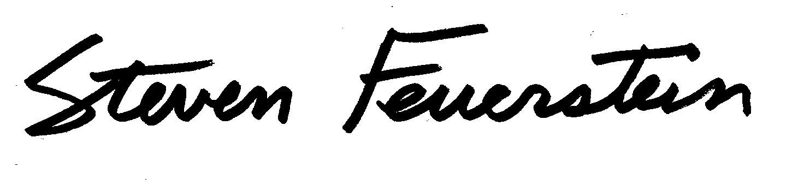

# About

## Foreword

In the I.T. world of today, robust and secure applications are becoming more and more important. Many business processes no longer work without I.T. and the dependence of businesses on their I.T. has grown tremendously, meaning we need robust and maintainable applications. An important requirement is to have standards and guidelines, which make it possible to maintain source code created by a number of people quickly and easily. This forms the basis of well functioning off- or on-shoring strategy, as it allows quality assurance to be carried out efficiently at the source. 

Good standards and guidelines are based on the wealth of experience and knowledge gained from past (and future?) problems, such as those, which can arise in a cloud environment, for example. 

 
Urban Lankes 
President of the bord of directors 
Trivadis 

***

The Oracle Database Developer community is made stronger by resources freely shared by experts around the world, such as the Trivadis Coding Guidelines. If you have not yet adopted standards for writing SQL and PL/SQL in your applications, this is a great place to start.   

Steven Feuerstein 
Team Lead, Oracle Developer Advocates 
Oracle  

***

Coding Guidelines are a crucial part of software development. It is a matter of fact, that code is more often read than written – therefore we should take efforts to ease the work of the reader, which is not necessarily the author.

I am convinced that this standard may be a good starting point for your own guidelines.  

Roger Troller 
Senior Consultant 
finnova AG Bankware 

***

## License

The Trivadis PL/SQL &amp; SQL Coding Guidelines are licensed under the Apache License, Version 2.0. You may obtain a copy of the License at <http://www.apache.org/licenses/LICENSE-2.0>.

### Trademarks

All terms that are known trademarks or service marks have been capitalized. All trademarks are the property of their respective owners.

### Disclaimer

The authors and publisher shall have neither liability nor responsibility to any person or entity with respect to the loss or damages arising from the information contained in this work. This work may include inaccuracies or typographical errors and solely represent the opinions of the authors. Changes are periodically made to this document without notice. The authors reserve the right to revise this document at any time without notice.

## Revision History

Version | Who         | Date         | Comment
--------|-------------|--------------|--------
0.1     | Troller     | 17.03.2009   | Created.
0.1     | Troller     | 17.03.2009   | Created.
0.2     | Kulessa     | 04.05.2009   | Extended.
0.3     | Reiner      | 12.05.2009   | Extended with comments in code.
0.4     | Troller     | 14.05.2009   | Extended formatting.
0.5     | Kulessa     | 20.05.2009   | Added more CodeXpert rules.
0.6     | Troller     | 22.05.2009   | Formatting changes. Added categories to rules.
0.7     | Reiner      | 10.06.2009   | Extended with example code commenting.
0.8     | Troller     | 18.06.2009   | Finalized.
0.9     | Bushnell    | 23.06.2009   | Translation.
1.0     | Troller     | 01.07.2009   | Ready for inspection.
1.1     | Troller     | 19.08.2009   | Added Inspection results AFl.
1.2     | Troller     | 21.08.2009   | Added Inspection results ThM.
1.3     | Troller     | April 2010   | Several Corrections. New Rule Oracle Supplied Packages.
1.3.1   | Troller     | October 2010 | Some formatting.
2.0     | Troller     | August 2011  | Added Error Handling Section. Added rule 23, 30, 31, 43.
3.0     | Troller     | January 2016 | Added Rules for ORACLE 12c. Added SQALE Metrics. New guideline numbering system.
3.1     | Troller     | April 2016   | Corrections
3.2     | Salvisberg  | January 2017 | Various small corrections
3.3     | see [Commits](https://github.com/Trivadis/plsql-and-sql-coding-guidelines/commits/master) | July 2018    | Migrated from Microsoft Word document to [MkDocs](https://www.mkdocs.org/).

